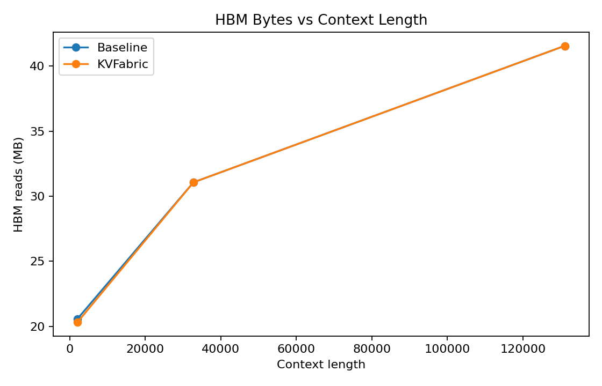
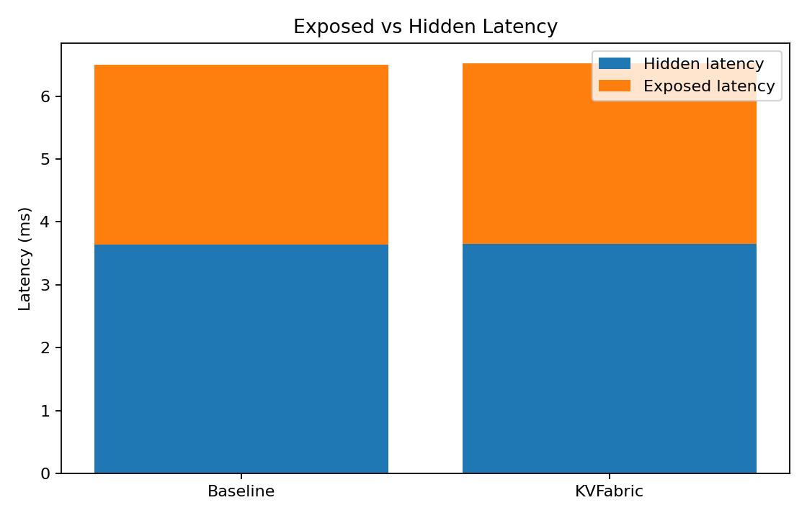

# KVFabric

[](https://github.com/manishklach/KVFabric/actions/workflows/ci.yml)

KVFabric explores semantic KV-cache orchestration, memory tiering, and
HBM/CXL movement tradeoffs for long-context LLM inference systems.

It is an exploratory simulator for studying whether future inference systems
may require more explicit KV-aware memory orchestration layers. The project
models KV residency tiering, compression, SRAM staging, prefetch scheduling,
HBM/CXL movement tradeoffs, hot/warm/cold KV classification, and emerging
control-plane concepts. The goal is not to replace GPU compute or serving
frameworks, but to give infrastructure and systems teams a concrete
environment for reasoning about KV-cache movement, placement, reuse, and
future runtime-to-memory orchestration contracts.

KVFabric is intentionally positioned as a careful architecture exploration. It
uses approximate workload and memory models to investigate how KV-cache might
evolve from a tensor allocation concern into a first-class inference memory
orchestration problem.

## Research Positioning

KVFabric should be viewed as:

- a systems research platform
- an architecture exploration framework
- a future inference-memory study
- a policy experimentation environment

It should not be viewed as:

- production inference software
- production silicon
- a benchmark competition

## What KVFabric Is

KVFabric is:

- an architecture prototype
- a systems simulator
- a control-plane model

for exploring future KV-aware inference-memory fabrics and accelerator
architectures.

The project investigates how future long-context inference systems might:

- orchestrate KV-cache movement
- manage memory residency
- stage data through SRAM
- overlap DMA and compute
- compress cold KV state
- coordinate HBM/CXL/DRAM tiers

KVFabric does NOT currently implement:

- production silicon
- GPU kernels
- FPGA hardware
- production runtimes

Instead, KVFabric explores the architectural mechanisms and
scheduling-and-control concepts that a future inference-memory accelerator or
memory-side orchestration engine might require.

## Future Inference Stack

```text
+------------------------------------------------------+
|                  Future Inference Stack              |
+------------------------------------------------------+
|                    Application Layer                 |
+------------------------------------------------------+
|             LLM Runtime / Scheduler                  |
+------------------------------------------------------+
| KVFabric Layer                                       |
| ---------------------------------------------------- |
| Residency Tracking                                   |
| DMA Scheduling                                       |
| Compression / Rehydration                            |
| SRAM Staging                                         |
| Tier Placement                                       |
| Overlap Coordination                                 |
| +--------------------------------------------------+ |
| HBM / CXL / DRAM / Storage                           |
| +--------------------------------------------------+ |
| GPU / Accelerator Compute                            |
| +--------------------------------------------------+ |
+------------------------------------------------------+
```

KVFabric explores whether inference-memory orchestration may eventually become
a first-class systems layer between the runtime and the heterogeneous memory
resources that support long-context decode.

## About KVFabric

KVFabric is a systems-oriented research prototype for infrastructure
engineers, runtime teams, systems researchers, and accelerator architects who
want to study KV-cache placement and movement as an inference-memory
orchestration problem rather than only as a buffer-allocation problem.

## Architecture

```text
                +----------------------+
                |    GPU Compute       |
                | Attention / Matmul   |
                +----------+-----------+
                           |
                 KV Commands / Requests
                           |
                +----------v-----------+
                |     KVFabric         |
                |----------------------|
                | DMA Scheduler        |
                | Residency Tracker    |
                | Compression Engine   |
                | SRAM Staging Buffers |
                | Prefetch Queue       |
                +----------+-----------+
                           |
         +----------------+----------------+
         |                |                |
      +--v---+        +---v---+        +---v---+
      | HBM  |        |  CXL  |        | DRAM  |
      +------+        +-------+        +-------+
```

KVFabric does not replace GPU compute. It explores orchestration of KV-cache
movement and residency around the compute path, especially when long-context
decode becomes constrained by memory placement, bandwidth, and reuse behavior.

## Architectural Evolution

KVFabric is currently at the architecture exploration and simulation stage.

Phase 1 focused on:

- memory hierarchy simulation
- residency modeling
- scheduler experimentation

Phase 2 expands into:

- overlap-aware orchestration
- trace-driven simulation
- policy experimentation

Future exploration may extend toward:

- memory-side acceleration concepts
- DMA offload architectures
- KV-aware memory fabrics
- CXL-attached orchestration engines
- runtime integration concepts

## Current Scope vs Future Direction

| Current Repository Scope | Future Architectural Exploration |
| --- | --- |
| Simulator | Accelerator architecture studies |
| Scheduler policies | DMA offload engines |
| Trace replay | Runtime integration |
| Compression models | Compression acceleration |
| Residency tracking | Hardware residency engines |
| Memory hierarchy modeling | Memory-side orchestration hardware |
| Overlap simulation | FPGA experiments |
| Systems exploration | Silicon implementation research |

## Why This Matters Now

Long-context inference, multi-tenant serving, and reuse-heavy decode workloads
are pushing KV-cache toward the center of serving system design. As context
windows grow, KV state expands quickly, HBM pressure rises, memory bandwidth
becomes a larger share of the bottleneck, and inference economics depend more
on how efficiently that state is placed and moved.

The industry is already moving toward more explicit KV management. vLLM
PagedAttention made KV layout and paging a first-order systems topic.
TensorRT-LLM has brought more attention to KV reuse and compressed cache
representations. NVIDIA Dynamo has highlighted KV-aware routing as part of
runtime control. CXL memory pools and other expanded-memory designs add
another dimension: orchestration across tiers may matter as much as raw
capacity.

KVFabric exists to study that trend in a restrained way.

## What KVFabric Models

- KV residency tiering across SRAM, HBM, CXL memory, and host DRAM
- hot/warm/cold block classification
- simulated KV compression states and decompression penalties
- SRAM staging and prefetch queues
- DMA-like movement scheduling
- rough cost-aware memory tradeoff proxies
- baseline versus KV-aware compare runs

## What KVFabric Is Not

- Not a production accelerator
- Not a GPU replacement
- Not a CUDA competitor
- Not a benchmark suite
- Not production silicon

KVFabric is currently an exploratory systems simulator and architecture
prototype.

## Future Accelerator Direction

KVFabric also explores the possibility of future KV-aware inference-memory
accelerators or memory-side orchestration engines.

Potential future directions include:

- DMA offload
- compression acceleration
- SRAM staging engines
- CXL-attached orchestration layers
- memory-side scheduling hardware

These concepts are currently architectural explorations and simulator-driven
studies, not product claims or hardware announcements.

## Why KVFabric Is Different From a Compute Accelerator

Traditional accelerators optimize:

- tensor compute
- matmul throughput
- FLOPS

KVFabric instead explores:

- memory movement
- residency orchestration
- staging
- DMA overlap
- semantic scheduling
- inference-memory fabrics

KVFabric is intended to complement compute accelerators rather than replace
them.

## Why This Could Become Strategic

Important control points in computing tend to emerge around coordination:
networking, storage, orchestration, and memory systems all became more central
once simple local optimization stopped being enough.

Inference infrastructure may be approaching a similar moment. If KV placement,
movement, reuse, compression, and overlap meaningfully shape cost and latency,
then inference-memory orchestration may itself become a strategic systems
layer.

That future layer could involve:

- inference-memory orchestration services
- KV-aware runtime APIs
- residency-aware memory fabrics
- memory-side scheduling systems

KVFabric studies that possibility as an architecture thesis rather than as a
product claim.

## Repository Layout

```text
KVFabric/
  docs/
  results/
  simulator/
    kvfabric/
    examples/
    results/
  diagrams/
  blog/
  tests/
```

## Quickstart

```bash
cd KVFabric
python simulator/run_experiment.py --mode baseline
python simulator/run_experiment.py --mode kvfabric
python simulator/run_experiment.py --mode compare
python simulator/run_experiment.py --mode compare --show-config
python simulator/run_experiment.py --mode compare --cost-model
python simulator/run_experiment.py --mode policy-compare
python simulator/run_experiment.py --mode sweep --sweep context_length
python simulator/run_experiment.py --mode compare --hardware H100_SXM5
python simulator/run_experiment.py --trace examples/traces/sharegpt_small.jsonl
python simulator/run_experiment.py --mode compare --workload examples/workloads/default_8k.json
python simulator/generate_trace.py --output examples/traces/chat_8k.jsonl --context-length 8192 --decode-steps 128
python simulator/plot_results.py
python -m pytest
```

Python 3.11+ is recommended. The core simulator uses the standard library.
`pytest` and `matplotlib` are optional extras for testing and figure
generation.

## Early Exploratory Simulation Output

The first synchronous version of the simulator produced the following
exploratory output:

```text
metric                      | baseline       | kvfabric       | delta
------------------------------------------------------------------------------
total_bytes_moved           | 0              | 850,919,424    | 850,919,424
hbm_bytes_read              | 1,329,594,368  | 27,262,976     | -1,302,331,392
cxl_bytes_read              | 0              | 227,540,992    | 227,540,992
host_bytes_read             | 0              | 0              | 0
compression_savings_bytes   | 0              | 164,626,432    | 164,626,432
simulated_latency_ns        | 9,631,984.98   | 72,242,087.30  | 62,610,102.32
sram_hit_rate               | 0.0000         | 0.5126         | 0.5126
blocks_evicted              | 0              | 0              | 0
blocks_compressed           | 0              | 5,696          | 5,696
```

These are not benchmark results. The early model showed reduced HBM traffic
but higher simulated latency. That behavior is expected in the original
version because movement, decompression, and consumption were modeled
conservatively and largely synchronously.

The fuller note is in [results/README.md](./results/README.md).

## Why Overlap Matters

The first simulator revision made the movement tradeoff visible, but it also
overstated stall cost because DMA movement, decompression, and attention
consumption were treated too serially. The current simulator now includes an
overlap-aware pipeline with asynchronous prefetch, SRAM staging, exposed
versus hidden transfer accounting, and partial decompression overlap.

This remains simulated and approximate. It is meant to improve the realism of
the orchestration model, not to imply production performance claims.

## Current Compare Snapshot

The current overlap-aware model still shows slightly higher simulated latency
than the baseline path on the default workload, but the gap is materially
smaller than in the first fully synchronous version and is now broken into
exposed versus hidden transfer components.

| Signal | Baseline | KVFabric |
| --- | --- | --- |
| HBM traffic | `166,199,296` bytes | `165,150,720` bytes |
| Exposed latency | `2,858,921.92` ns | `2,868,534.68` ns |
| SRAM hit rate | `0.0000` | `0.1107` |

KVFabric currently demonstrates a modeling framework for studying KV-cache
residency and movement tradeoffs, including cases where orchestration overhead
still outweighs locality gains.

## Runtime API Direction

KVFabric also includes an early runtime API sketch for what a future
KV-aware control plane might require from a serving runtime. The current
repository does not integrate with vLLM, SGLang, or TensorRT-LLM, but it now
documents the sort of block-allocation, access-notification, prefetch, release,
and telemetry hooks that such an orchestration layer would likely need.

See [Runtime API Sketch](./docs/runtime_api.md).

## Results Figures





## Future Work

- asynchronous DMA overlap refinements
- overlapped decompression with richer staging behavior
- token-level pipeline simulation
- realistic decode traces and reuse-distance studies
- CXL-aware residency policies
- KV locality prediction heuristics
- scheduler policy comparisons across workloads
- optional FPGA prototype exploration
- runtime integration experiments with serving stacks

## FAQ

### Why not just use larger HBM?

Larger HBM helps, but HBM is expensive, capacity-limited, and constrained by
system power and bandwidth realities. Long-context, multi-tenant inference can
scale KV memory faster than economically practical HBM capacity. KVFabric
explores whether semantic tiering and orchestration can complement HBM rather
than assuming HBM alone will absorb the entire footprint.

### Is KVFabric an accelerator?

KVFabric is currently an architecture prototype, simulator, and control-plane
model for a future KV-aware inference-memory accelerator or orchestration
layer. It is not production hardware.

### Does KVFabric replace GPUs?

No. GPUs and other accelerators perform tensor compute. KVFabric studies the
memory orchestration path around them.

### Are the numbers benchmarks?

No. They are exploratory simulation outputs and architecture-oriented proxies.

## Releases

- [v0.1.0 — Initial architecture and simulation prototype](./docs/releases/v0.1.0.md)
- [v0.2.0-preview — Runtime API, policy comparisons, and cost-aware modeling](./docs/releases/v0.2.0-preview.md)
- [v0.2.1 — Realistic hardware profiles, trace replay, and improved overlap modeling](./docs/releases/v0.2.1.md)

## Documentation

- [Technical Spec (HTML)](./docs/index.html)
- [Vision](./docs/vision.md)
- [Why KVFabric Could Matter](./docs/why_kvfabric_matters.md)
- [Runtime API Sketch](./docs/runtime_api.md)
- [Traces](./docs/traces.md)
- [Architecture](./docs/architecture.md)
- [Memory Model](./docs/memory_model.md)
- [Accelerator Sketch](./docs/accelerator.md)
- [Future Accelerator Architecture](./docs/future_accelerator_architecture.md)
- [Architecture Glossary](./docs/architecture_glossary.md)
- [Scheduler Policy](./docs/scheduler.md)
- [Compression Model](./docs/compression.md)
- [Cost Model Proxy](./docs/cost_model.md)
- [Overlap Model](./docs/overlap_model.md)
- [Industry Context](./docs/industry_context.md)
- [Methodology](./docs/methodology.md)
- [Related Work](./docs/related_work.md)
- [Roadmap](./docs/roadmap.md)
- [Repository Description](./docs/repository_description.md)
- [Recommended GitHub Topics](./docs/github_topics.md)
- [Release Notes v0.1.0](./docs/releases/v0.1.0.md)
- [Release Notes v0.2.0-preview](./docs/releases/v0.2.0-preview.md)
- [Release Notes v0.2.1](./docs/releases/v0.2.1.md)
- [Exploratory Results Note](./results/README.md)
- [Policy Comparison Results](./results/policy_comparison.md)
- [Sensitivity Sweep Results](./results/sensitivity_sweep.md)
- [ShareGPT-Inspired Evaluation](./results/sharegpt_evaluation.md)
- [Architecture Diagram Source](./diagrams/kvfabric_architecture.md)
- [Systems Blog Draft](./blog/kv-cache-is-the-new-memory-hierarchy.md)

## Related Work and Naming Note

This repository is not affiliated with the academic KVFlow paper on
multi-agent workflow prefix caching. That work focuses on workflow-aware
prefix reuse for agent execution, while this repository focuses on inference
memory hierarchy simulation for KV-cache residency, compression, staging, and
movement.

See [Related Work](./docs/related_work.md)
for the short comparison.

## Research Prototype Disclaimer

KVFabric is an exploratory research simulator intended for studying KV-cache
residency, movement, and compression tradeoffs in long-context inference
systems.

The project does not model real GPU kernels, production runtimes, or
production silicon performance.

Current latency numbers come from an approximate overlap-aware simulator. They
are useful for architecture exploration, but they are not kernel measurements
or production runtime timings.

Previously developed under the working title KVFlow.
