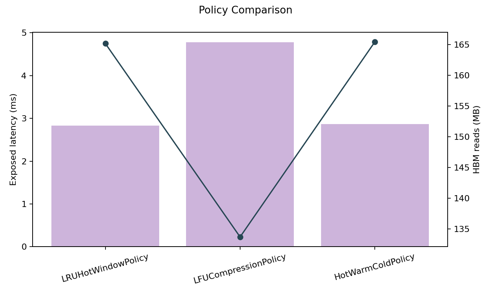

# Policy Comparison

This note records an exploratory policy comparison on the default synthetic
`default_8k.json` workload. It is not a benchmark. The goal is to show how
different policy shapes shift HBM pressure, CXL traffic, SRAM locality, and
exposed stall inside the simulator.

## Policy Compare Output

```text
policy               | hbm_bytes_read  | cxl_bytes_read | sram_hit_rate | exposed_latency_ns | compression_savings_bytes
------------------------------------------------------------------------------------------------------------------------
LRUHotWindowPolicy   | 165,150,720     | 524,288        | 0.1296        | 2,828,304.66       | 524,288
LFUCompressionPolicy | 133,693,440     | 15,990,784     | 0.0918        | 4,770,401.43       | 7,864,320
HotWarmColdPolicy    | 165,412,864     | 393,216        | 0.1107        | 2,863,174.68       | 393,216
```



## What This Suggests

- `LRUHotWindowPolicy` is the most locality-friendly under this workload. It
  keeps SRAM hit rate highest and exposed latency lowest, but does not change
  HBM traffic much.
- `LFUCompressionPolicy` is more aggressive about reducing footprint. It
  lowers HBM traffic materially and increases compression savings, but it pays
  for that with much more CXL traffic and visibly worse exposed latency.
- `HotWarmColdPolicy` remains the more balanced default-style policy. It is
  less aggressive than the LFU-heavy profile and slightly less locality-first
  than the widened LRU profile.

## Workload Assumptions

This comparison uses the default synthetic workload:

- `model_layers: 32`
- `num_heads: 32`
- `head_dim: 128`
- `batch_size: 4`
- `context_length: 8192`
- `decode_steps: 128`
- `dtype_bytes: 2`
- `kv_block_tokens: 16`

## Current Limitations

- This comparison is highly workload-sensitive.
- Policies are hand-tuned heuristics, not learned or runtime-trained strategies.
- Exposed latency remains simulator-derived, not kernel-measured.
